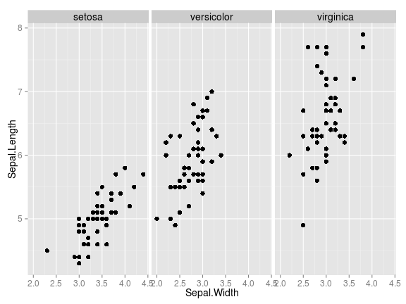
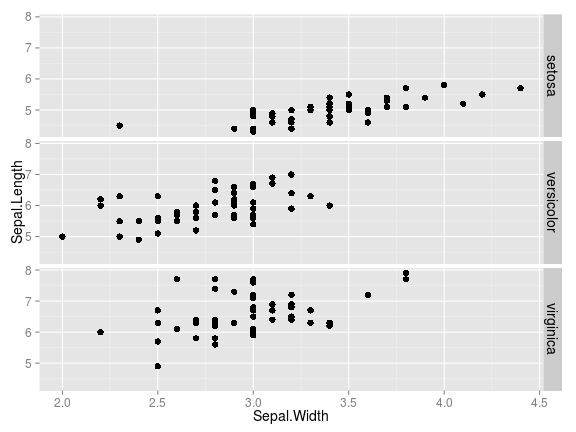
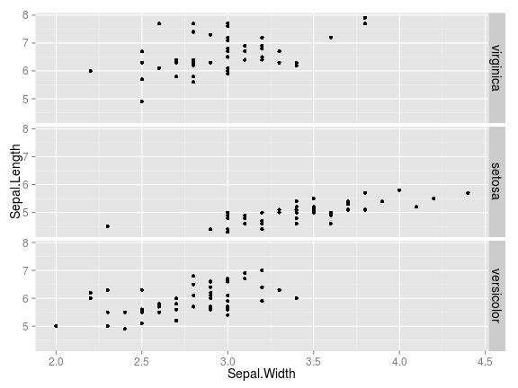
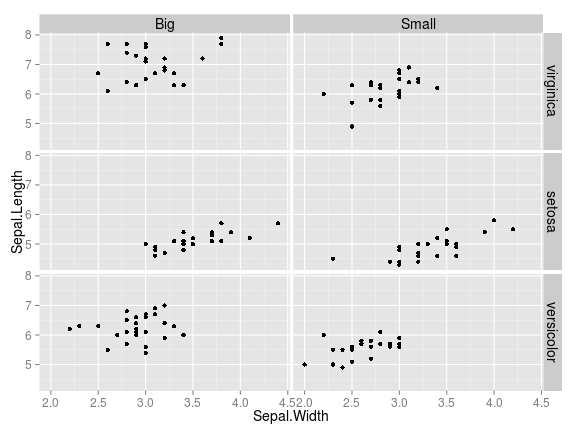
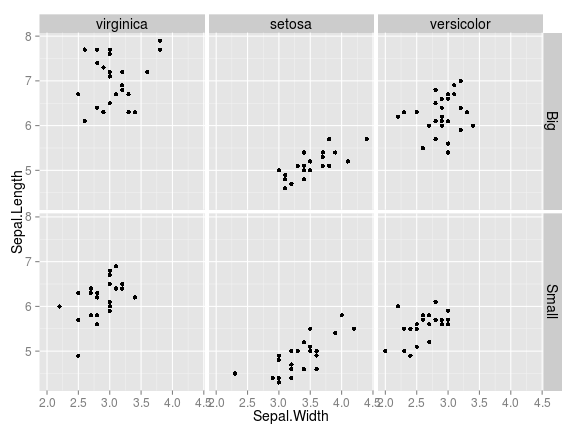
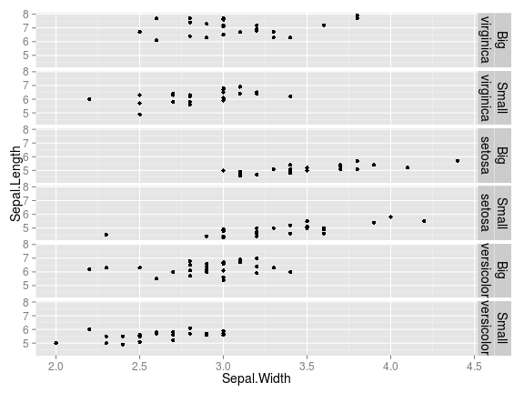
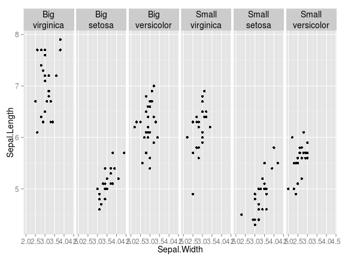
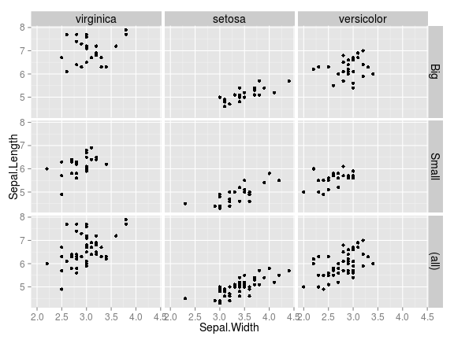
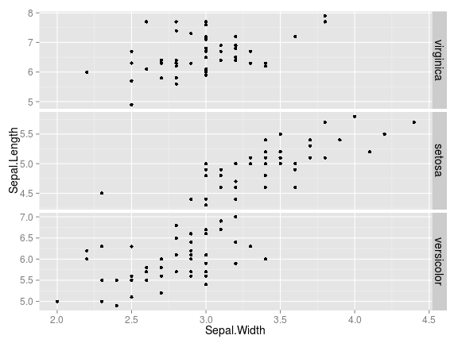
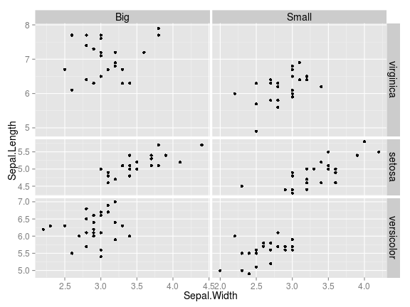

---
html_document:
  toc: true
title: "Using the facet_grid() function in ggplot2"
---


# Basic Syntax abc
The first few lines help set everything up.  We create a new variable on the `iris` dataset so that we can make some more interesting plots.  Second, we create a theme for our plots so that the labels and titles are readable.


```r
library(ggplot2)
library(dplyr)

iris <- iris %>% group_by(Species) %>% mutate(Big.Leaf=ifelse(Petal.Length > mean(Petal.Length),'Big','Small'))

# Theme elements to make plot nicer
facet_theme <-
  theme(axis.text.x=element_text(size=12),    # Change x-axis value text-size
        axis.title.x=element_text(size=14),   # Change x-axis label text-size
        axis.text.y=element_text(size=12),    # Change y-axis value text-size
        axis.title.y=element_text(size=14),   # Change y-axis label text-size
        strip.text.x=element_text(size=14),
        strip.text.y=element_text(size=14))

curPlot <- ggplot(iris,aes(Sepal.Width,Sepal.Length))+geom_point(size=3)+facet_theme

# As Columns
curPlot+facet_grid(.~Species)
```



```r
# As Rows
curPlot+facet_grid(Species~.)
```



<a href="#top">Back to top</a>

# Re-ordering the panels
Simply re-order factor levels to change the order in which they're displayed

```r
iris$Species <- factor(iris$Species,levels=c('virginica','setosa','versicolor'))
# Remake plot with new level order
curPlot <- ggplot(iris,aes(Sepal.Width,Sepal.Length))+geom_point(size=2)+facet_theme
curPlot+facet_grid(Species~.)
```



# Panel By 2 Features


```r
curPlot+facet_grid(Species~Big.Leaf)
```



```r
curPlot+facet_grid(Big.Leaf~Species)
```



## 


```r
curPlot+facet_grid(Species+Big.Leaf~.)
```



```r
curPlot+facet_grid(.~Big.Leaf+Species)
```



# Add Marginal Panels

## Single Dimension Margins


```r
curPlot+facet_grid(Big.Leaf~Species,margins='Big.Leaf')
```



## Include All Margins


```r
curPlot+facet_grid(Big.Leaf~Species,margins=TRUE)
```


# Axis Control

Normally, axes have a fixed range common to all panels and all panels are the same dimensions.  We can allow the limits and the dimensions of the axes to vary freely.


```r
curPlot+facet_grid(Species~.,scales='free')
```



```r
curPlot+facet_grid(Species~Big.Leaf,scales='free',space='free')
```



<a href="#top">Back to top</a>

# More Resources
- [Source as RMarkdown](https://github.com/rweyant/bertplot/blob/master/R/tutorials/ggplot-histogram/ggplot-histogram.Rmd)
- [docs.ggplot2.org](http://docs.ggplot2.org/0.9.3.1/facet_grid.html)


