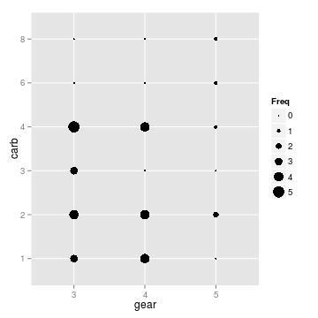
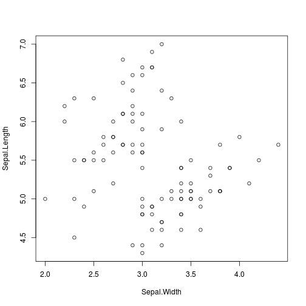

# The Problem

### R code can get hard to read


```r
sapply(iris[iris$Sepal.Length < mean(iris$Sepal.Length),-5],FUN = mean)
```

### A (Possible) Solution - the pipe %>% {.build}

- Similar to Unix pipe |
- Code can be written in the order of execution, left to right
- `%>%` will "pipe" information from one statement to the next
  * `x %>% f` is equivalent to `f(x)`
  * `x %>% f(y)` is equivalent to `f(x,y)`
  * `x %>% f %>% g %>% h` is equivalent to `h(g(f(x)))`

<b>{magittr} provides 4 special operators</b>

- `%>%` - pipe operators
- `%T>%` - tee operator
- `%$%` - exposition operator
- `%<>%` - compound assignment pipe operator


<a href="#top">Back to top</a>

# What %>% is doing

The `%>%` is taking the output of the left-hand side and using that for
the first argument of the right-hand side, or where it finds a *`.`*

### Basic Example


```r
df <- data.frame(x1=rnorm(100),x2=rnorm(100),x3=rnorm(100))

df %>% head(1)  # same as using head(df,1)
```

```
##          x1        x2          x3
## 1 0.8421295 0.1814191 -0.06159804
```

```r
df %>% head(.,1)  # same as using head(df,1)
```

```
##          x1        x2          x3
## 1 0.8421295 0.1814191 -0.06159804
```

### Slightly more complicated example


```r
library(ggplot2)
mtcars %>%
  xtabs(~gear+carb,data=.) %>%
  as.data.frame %>%
  ggplot(.,aes(x=gear,y=carb,size=Freq)) +
  geom_point()
```




### Even more complicated example


```r
# Generate some sample data.
df <-
  data.frame(
    Price    = 1:100 %>% sample(replace = TRUE),
    Quantity = 1:10  %>% sample(replace = TRUE),
    Type     =
      0:1 %>%
      sample(replace = TRUE) %>%
      factor(labels = c("Buy", "Sell"))
  )
```
[Source](http://www.r-statistics.com/2014/08/simpler-r-coding-with-pipes-the-present-and-future-of-the-magrittr-package/)


<a href="#top">Back to top</a>


## The combination of %>% with {dplyr}

- `filter()`
- `group_by()`
- `summarise()`,`summarize()`
- `arrange()`
- `mutate()`
- `select()`


```r
sapply(iris[iris$Sepal.Length < mean(iris$Sepal.Length),-5],FUN = mean)
```

```
## Sepal.Length  Sepal.Width Petal.Length  Petal.Width 
##      5.19875      3.13375      2.46250      0.66375
```

```r
iris %>%
  mutate(avg.length=mean(Sepal.Length)) %>%
  filter(Sepal.Length<avg.length) %>%
  select(-Species,-avg.length) %>%
  summarise_each(funs(mean))
```

```
##   Sepal.Length Sepal.Width Petal.Length Petal.Width
## 1      5.19875     3.13375       2.4625     0.66375
```

<a href="#top">Back to top</a>

## %$% The exposition operator

- Similar to `with()` or `attach()`
- Useful for functions that don't take a data parameter


```r
table(CO2$Treatment,CO2$Type)
```

```
##             
##              Quebec Mississippi
##   nonchilled     21          21
##   chilled        21          21
```

```r
# with(CO2,table(Treatment,Type))
CO2 %$% table(Treatment,Type)
```

```
##             Type
## Treatment    Quebec Mississippi
##   nonchilled     21          21
##   chilled        21          21
```

<a href="#top">Back to top</a>

## %T>% The Tee Operator

- Allows a "break" in the pipe.
- Executes right-hand side of `%T>%`, but will continue to pipe through to next statement


```r
iris %>%
filter(Species != 'virginica') %>%
select(Sepal.Width,Sepal.Length) %T>%
plot %>%  # Make scatterplot and keep going
colMeans
```

 

```
##  Sepal.Width Sepal.Length 
##        3.099        5.471
```

<a href="#top">Back to top</a>

## %<>% The Compound Assignment Operator
- Combines a pipe and an assignment operator
- Think `i++` or `x+=z` from the C family, Python, Ruby, etc.

<a href="#top">Back to top</a>

## %<>% The Compound Assignment Operator

```r
df <- rexp(5,.5) %>% data.frame(col1=.)
df
```

```
##        col1
## 1 0.2871829
## 2 3.4628332
## 3 0.5716582
## 4 1.8430468
## 5 1.9281341
```

```r
df %<>% arrange(col1)
df
```

```
##        col1
## 1 0.2871829
## 2 0.5716582
## 3 1.8430468
## 4 1.9281341
## 5 3.4628332
```

<a href="#top">Back to top</a>

# More Resources
- [magrittr on GitHub](https://github.com/smbache/magrittr)
- [dplyr and pipes: the basics](http://seananderson.ca/2014/09/13/dplyr-intro.html)
- [pipeR vs. magrittr](http://renkun.me/blog/2014/08/08/difference-between-magrittr-and-pipeR.html)
